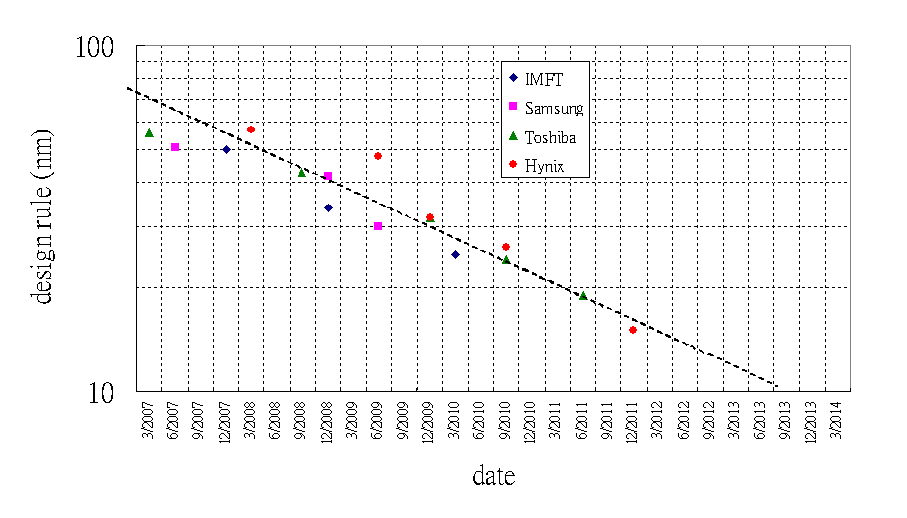

Journal 4
===

#### cirno9

 

Q1: What did you learn today?

> From this course I have learnt something about how computers work that contains several points, which are types of computers, structures of computers and functions of them. On top of that, as the development of the science, computers were being more portable and faster, however, the structures of them have hardly changed, which include CPU, main memory, I/O and system interconnection, all of them construct a complex network, and it’s the principle of the functions of them, which are data processing, data storage, data movement and control. What’s more, we learnt a little about the Moore’s Law. This law forecast the future of the computer, which illustrated some impressive consequences that seem true today.

Q2: How computers have changed our life?

> As the fast development, computers can help us broaden our knowledge about the world more conveniently, while it has some negative effects, for it may be harmful to our health. As the reports said, the number of the people who have poor eyesight is increasingly growing.

Q3: What item of technology do you believe has had the biggest impact on humans to date?

> In my opinion, paper is the most significant invention to people. Before paper appeared, people used to write something on bamboo or wood. However, it was very difficult to do this, and it also cost massive materials. To solve this problem, Chinese invented the paper and spread paper all over the world. Now paper is still a common item for human to record or write something, and without paper, technology and science wouldn't develop so rapidly. So I think paper is the most important item of technology which has had the greatest influence on humans to date.

Q4: What`s next?

> Moore's law is the observation that the number of transistors in a dense integrated circuit doubles approximately every two years. The observation is named after Gordon Moore, the co-founder of Fairchild Semiconductor and Intel, whose 1965 paper described a doubling every year in the number of components per integrated circuit,[2] and projected this rate of growth would continue for at least another decade.[3]Moore's prediction proved accurate for several decades, and has been used in the semiconductor industry to guide long-term planning and to set targets for research and development.[4]But Moore's law is an observation or projection and not a physical or natural law and most semiconductor industry forecasters, including Gordon Moore,[5] expect Moore's law will end by around 2025.[6][7][8]One of the key challenges of engineering future nanoscale transistors is the design of gates. As device dimension shrinks, controlling the current flow in the thin channel becomes more difficult.

[9]

Reference:

1. Moore, Gordon E. (1965-04-19). "Cramming more components onto integrated circuits". Electronics. Retrieved 2016-07-01.

2. The trend begins with the invention of the integrated circuit in 1958. See the graph on the bottom of page 3 of Moore's original presentation of the idea.[1]

3. Moore, Gordon E. (1965). "Cramming more components onto integrated circuits" (PDF). Electronics Magazine. p. 4. Retrieved 2006-11-11.

4. Disco, Cornelius; van der Meulen, Barend (1998). Getting new technologies together. New York: Walter de Gruyter. pp. 206–207. ISBN 3-11-015630-X. OCLC 39391108. Retrieved August 23, 2008.

5. Cross, Tim. "After Moore's Law". The Economist Technology Quarterly. Retrieved 2016-03-13. chart: "Faith no Moore" Selected predictions for the end of Moore's law"

6. Kumar, Suhas (2012). "Fundamental Limits to Moore's Law". arXiv:1511.05956 Freely accessible.

7.  The chips are down for Moore's law Nature, February 2016

8. Smaller, Faster, Cheaper, Over: The Future of Computer Chips NY Times, September 2015

9. Picture from wikipedia.org
